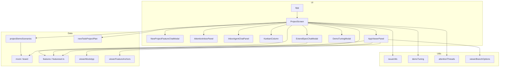

# Architecture Map

> Auto-generated architecture diagram. Last updated: 2026-05-11

## System Overview

## Component Index

| Component | Description | Key Files |
|-----------|-------------|-----------|
| App shell | Routes / wraps main screen | `src/App.tsx` |
| Project screen | Tabs: **Control Center** · **Inbox** · **Viewer**; **⋯** demo; **New project** planner; **Extending** reload; bot/HR rules | `src/components/ProjectScreen.tsx`, `NewProjectFeatureChatModal.tsx`, `StuckAgentChatPanel.tsx` |
| Inbox | Thread list + **right agent chat** (compact status strip + opening line, Send / Unblock for stuck); **Issue details** opens modal | `src/components/AttentionInboxPanel.tsx`, `InboxAgentChatPanel.tsx` |
| Attention threads | Inbox sources: **one thread per ticket** for human review & merge; **one per stuck agent** for in progress; **grouped by ticket** in the list | `src/utils/attentionThreads.ts` |
| App viewer | Todos mock + callouts; branch picker; **Merge** on Human Review branches → Control Center + same merge column animation / Features landing | `src/components/AppViewerPanel.tsx` |
| Kanban | **Drag** backlog → **Todo**; **Todo** shows bot rings once assigned; In Progress / Human Review rings; **in progress + stuck** → **Need from you**; stuck off Human Review; **JumpingRobot** under In Progress, **ReadyRobot** under Human Review | `src/components/KanbanColumn.tsx`, `IssueCard.tsx`, `JumpingRobot.tsx`, `ReadyRobot.tsx` |
| New project planner | Two-pane modal: local “chat” + **Draft parallel plan**; **Approve** loads **Backlog only** (empty Features until **merge** lands tiles) | `src/components/NewProjectFeatureChatModal.tsx` |
| Extend modal | Spec chat (extend catalog feature → new backlog issue, or **Specify** backlog item → same UI, then **Todo** on resolve) | `src/components/ExtendSpecChatModal.tsx` |
| Features catalog | Todo-app v1: **4 user-facing groups** (lists → capture → task list → focus). **~50% shipped** tiles in the grid + **green** defaults; **planned** defs only for board tags until merge adds custom tiles | `src/data/featureset.ts` |
| Viewer mock | Static todos list + placeholder copy for Viewer | `src/data/viewerMockApp.ts` |
| Callout anchors | Positions for **todos-mock-only** callouts (layout, issues, filter, display); other features omit overlays in Viewer | `src/data/viewerFeatureAnchors.ts` |
| Board mock data | Todo-app **parallel workstreams** (decoupled features); tags reference shipped + planned catalog ids; used by **Extending a project** scenario | `src/data/mock.ts` |
| Demo scenarios | **Extending** (full `mock` + default catalog, reload). **New project** opens in-app planning chat (see below) | `src/data/projectDemoScenarios.ts` |
| New todo plan | Default parallel tracks for the New project modal (backlog rows; **not** pre-seeded into Features) | `src/data/newTodoProjectPlan.ts` |
| Project persistence | `localStorage` `orca.projectScreen.v1` — `viewTab` includes **inbox**; board, snoozes, Features, tile colors, viewer branch, `hideDefaultFeaturesetCatalog` | `src/utils/projectScreenPersistence.ts` |
| Demo tuning | `orca.demoTuning.v2` — in-progress **stuck probability** (0–1) and **seconds per bot** (5 / 7 / 10); todo pickup, **max in progress = 3**, merge animation fixed in code; **⋯ → Tune automation** | `src/utils/demoTuning.ts`, `DemoTuningModal.tsx` |
| Feature suggestions | Board-aware heuristics for “AI” add-feature ideas (local, no API) | `src/utils/suggestFeatures.ts` |
| Issue helpers | Backlog / grouping | `src/utils/issueUtils.ts` |
| Viewer branches | Build branch `<select>` options + **resolve HR issue** from branch value | `src/utils/viewerBranchOptions.ts` |
